<h1 align="center"> Hi, I'm Kawshalya 👋 </h1>

## About Me

I’m a passionate learner at the intersection of <b>technology and finance</b>. My interests lie in <b>cybersecurity and FinTech</b>, with a focus on developing innovative solutions to build secure and impactful systems.

⚙️ I am actively building skills in:
- Programming 
- Web & Cloud 
- Cybersecurity 

🎓 Currently, I'm pursuing,
- BSc (Hons) in Information Systems 
- BSc (External) in Financial Engineering

I believe in continuous learning and enjoy working on projects that connect finance, technology, and security. 🌱

## GitHub Stats 📈

<table align="center">
  <tr>
    <td>
      
    </td>
    <td>
      
    </td>
  </tr>
</table>

## Connect with Me:

<!--
**kawshalya-k/kawshalya-k** is a ✨ _special_ ✨ repository because its `README.md` (this file) appears on your GitHub profile.

Here are some ideas to get you started:

- 🔭 I’m currently working on ...
- 🌱 I’m currently learning ...
- 👯 I’m looking to collaborate on ...
- 🤔 I’m looking for help with ...
- 💬 Ask me about ...
- 📫 How to reach me: ...
- 😄 Pronouns: ...
- ⚡ Fun fact: ...
-->
